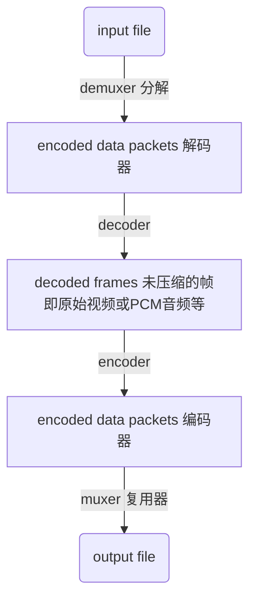
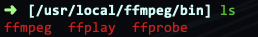
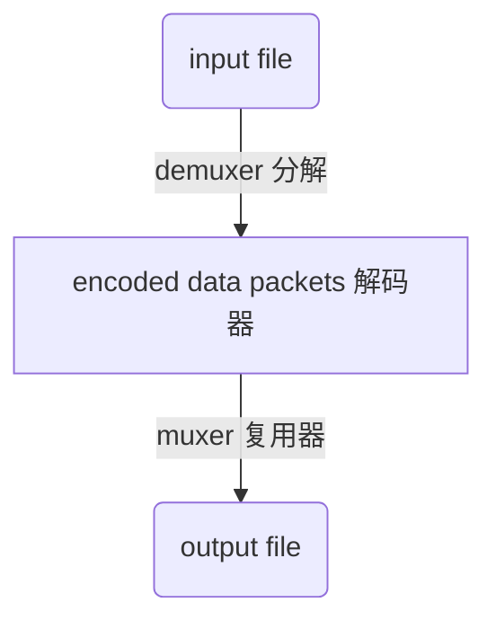
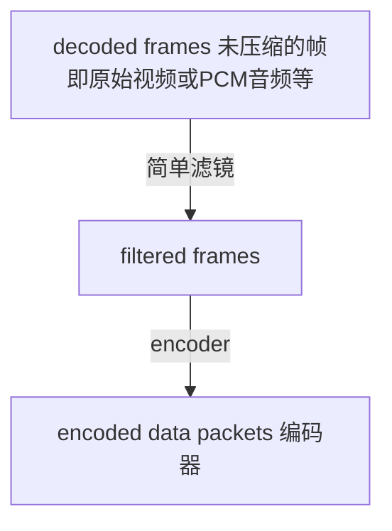
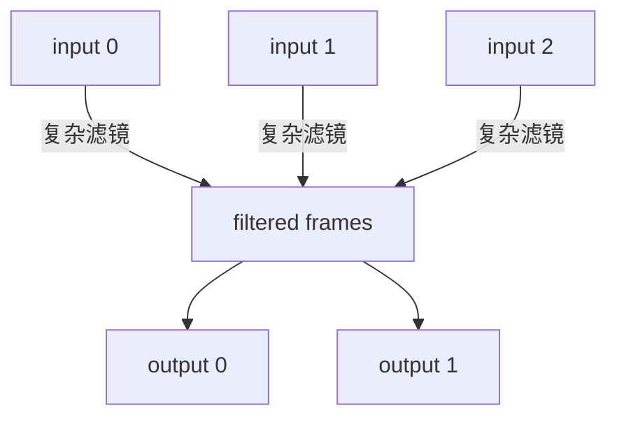

* content
{:toc}

更多有意思的内容，会在后续发布，请关注 Mr无畏公众号：


[TOC]

## 基本知识 
### FFmpeg 资源网站

[http://ffmpeg.org/](http://ffmpeg.org/)
[https://github.com/FFmpeg](https://github.com/FFmpeg)


### 音视频流
在音视频领域，一路音频或视频称为一路流。比如看电影可以选择声道，每个声道就是一个音频流。

### 容器

文件格式如 MP4、MOV 等称之为容器。容器可以存放多路音视频文件，有的智能存放一路视频流，比如MP4 可以存放一路视频流，多路音频流，多路字母流。

### 声道
音频中的 channel，一路音频流可以有单声道双声道和立体声。

### 命令种类

* 基本信息查询
* 录制
* 分解，复用
* 处理原始数据
* 滤镜
* 切割合并
* 图片视频互相转换
* 直播相关

### 处理流程
除了基本信息查询外，流程处理基本流程都是如下


muxer是指合并文件，即将视频文件、音频文件和字幕文件合并为某一个视频格式。比如把rmvb格式的视频，mp3格式的音频文件以及srt格式的字幕文件，合并成为一个新的mp4或者mkv格式的文件。
demuxer是muxer的逆过程，就是把合成的文件中提取出不同的格式文件。
在获得解码的未压缩的帧后，对帧进行各种滤镜处理。

## 下载

下载参考网址： [http://ffmpeg.org/download.html](http://ffmpeg.org/download.html)

可以直接 clone 源码

```
git clone https://git.ffmpeg.org/ffmpeg.git
```

## 目录结构


libavutil： 常用工具， hash 器，解码器，及其他工具

libavformat： 多媒体格式的解析封装

libavcodec: 所有音频编解码，不做具体操作，只是将编解码的模块功能插入进来, 提供一系列编解码的实现

libavdevice： 处理音视频设备， 进行音视频采集

libavfilter： 所有音视频的后期处理，比如加滤镜，提供了各种过滤器

libavresample： 对音频重采样

libswresample： 对音频的相关操作，混音重采样

libswscale： 对视频的相关操作，色彩转换和缩放功能

## 模块列表

使用下面的命令查看都有哪些模块：

```
./configure --help
```

```
Help options:
  --help                   print this message
  --quiet                  Suppress showing informative output
  --list-decoders          show all available decoders 显示所有可用的解码器
  --list-encoders          show all available encoders 显示所有可用的编码器
  --list-hwaccels          show all available hardware accelerators
  --list-demuxers          show all available demuxers
  --list-muxers            show all available muxers
  --list-parsers           show all available parsers
  --list-protocols         show all available protocols
  --list-bsfs              show all available bitstream filters
  --list-indevs            show all available input devices
  --list-outdevs           show all available output devices
  --list-filters           show all available filters
```

### 显示所有可用的解码器

解码器把数据编码文件转为模拟视音频


### 显示所有可用的编码器

编码器主要把模拟视音频信号压缩数据编码文件


## 显示所有可用滤镜

这里有很多音视频特效处理的功能，比如视频缩放、截取、翻转、叠加、跑马灯、视频转GIF等功能


## 编译

```
./configure --prefix=/usr/local/ffmpeg --enable-gpl --enable-nonfree --enable-libfdk-aac --enable-libx264 --enable-libx265 --enable-filter=delogo --enable-debug --disable-optimizations --enable-libspeex --enable-videotoolbox --enable-shared --enable-pthreads --enable-version3 --enable-hardcoded-tables --cc=clang --host-cflags= --host-ldflags=
```

--enable-gpl： 打开 gpl(通用公共许可证)
--enable-filter=delogo: 打开滤镜中的删除水印
--enable-debug： 调试模式（只在测试环境）
--disable-optimizations：关闭优化（只在测试环境）
--enable-libspeex：应用speex语音压缩，speex 是针对语音的开源免费，无专利保护的音频压缩格式
--enable-videotoolbox：Mac 平台下的低级的框架，可直接访问硬件的编解码器
--enable-shared：生成共享库
--enable-pthreads：使用 Pthread 线程,在类Unix操作系统（Unix、Linux、Mac OS X等）中，都使用Pthreads作为操作系统的线程。Windows操作系统也有其移植版pthreads-win32


如果提示某个库不存在，就需要进行安装，比如 Mac 下安装 libfdk-aac, libx264， libx265：

```
brew install fdk-aac
brew install x264
brew install x265
brew install nasm
brew install yasm
brew install sdl2
```

安装完这些缺失的库之后，就可以正常编译,执行如下命令：
```
make && make install
```

安装完成后的路径及结构：


include 文件夹下是头文件


lib 里是动态库

share 里是文档相关及例子

如果编译后没有 ffplay


可能有以下几个原因导致：

* 所使用的操作系统没有安装图形库
* 没有安装 SDL2 库。解决办法是通过 `brew install sdl2` 即可 或 通过 SDL2 源码安装。安装完成后，要重新进行到 ffmpeg目录下，执行 ./configure…命令
* 修改config.h文件，打开 config.h文件找 FFPLAY 关键字，将其后面的 0 修改为 1，保存并退出该文件。在当前目录下执行 make && sudo make install， 修改 config.h文件后，不要再执行./configure …了，否则config.h中的值又都恢复为原来的值了



ffprobe 是多媒体侦测器
ffplay 是多媒体播放器

## 执行命令

执行命令一般用以下路径的 ffmpeg


`/usr/local/ffmpeg/bin/ffmpeg`

将这个路径加入到环境变量中
`vim ~/.bash_profile`
添加下面路径
`export PATH=$PATH:/usr/local/ffmpeg/bin`
生效修改的环境变量
`source ~/.bash_profile`

## 基本查询命令

举例：`ffmpeg -version`

| 参数 | 说明 |
| --- | --- |
| -version | 版本 |
| -formats | 显示可用格式及设备 |
| -demuxers  | 显示可用 demuxers |
| -muxers | 显示可用的 muxers |
| -devices | 显示可用设备 |
| -codecs | 显示 libavcodec 已知的所有编码器 |
| -decoders | 显示可用的解码器 |
| -encoders | 显示所有可用的编码器 |
| -bsfs  | 显示可用的比特流 filter |
| -protocols | 显示可用的协议 |
| -filters | 显示可用的 libavfilter 过滤器 |
| -pix_fmts | 显示可用的像素格式 |
| -sample_fmts | 显示可用的采样格式 |
| -layouts | 显示 channel 名称和标准 channel 布局 |
| -colors | 显示识别的颜色名称 |

## 命令基本格式

`
ffmpeg [全局参数] {[输入参数] -i input_url} ...
`
-i 用来读取任意数量的输入文件、管道、网络流，如果是多文件索引从 0 开始
                    
`
ffmpeg [全局参数]  {[输出参数] output_url} ...
`


### 常用参数

| 参数 | 参数类型 |说明 |
| --- | --- | --- |
| -f fmt | 输入，输出参数 | 强制输入或输出文件格式，通常是根据扩展名字自动识别格式，本参数可不需要 |
| -i url | 输入，输出参数 |  输入文件地址 |
| -y  | 全局参数 | 强制自动覆盖输出文件 |
| -n | 全局参数 | 不覆盖输出文件，如果输出文件存在，则退出 |
| -c[:stream_specifier] 编/解码器 | 输入，输出参数，每个流 | 在输入文件之前选择一个解码器或在输出文件之前选择一个编码器，用于一个或者多个流。也可以在输出文件的时候仅输出不会被重新编码即跟参数 copy |
| -codec | 输入，输出参数，每个流 | 同 -c  |
| -t duration | 输入，输出参数 | -i之前用来限制从输入文件读取数据的持续时间，在输出 url 之前用来控制输出持续时间 |
| -ss位置 | 输入，输出参数 |  -i之前用于寻找输入文件的位置，但是大多数格式都不能精确搜索，因此搜索一般是在位置之前最近的搜索点。当转码和-accurate_seek 被启用时，搜索点和位置之间的分段会被解码和丢弃。当进行流式复用或使用 -noaccurae_seek 时，这个分段被保留。当在输出url之前使用的时候，会解码并丢弃开始到位置的分段 |
| -frames[:stream_specifier] framecount  | 输出参数，每个流 |  在这个帧之后写入流|
| -filter[:stream_specifie filtergraph  | 输出参数，每个流 | 创建过滤器图filtergraph，并过滤流，filtergraph 必须具有相同类型的流的单个输入和单个输出 |

## 视频参数

| 参数 | 参数类型 |说明 |
| --- | --- | --- |
| -vframes num | 输出参数 | 设置输出的视频帧的数量 |
| -r[:stream_specifier] fps | 输入输出参数，每个流 | 设置帧率。作为输入参数忽略文件中已存储时间戳，根据速率生成新的时间戳，作为输出参数复制或者丢弃输入帧以实现恒定输出帧频fps |
| -s[:stream_specifier] 大小 | 输入输出参数，每个流 | 设置窗口大小，作为输入参数，指 video_size, 作为输出参数会将缩放视频过滤器插入到相应过滤器图形的末尾 |
| -aspect[:stream_specifier] 宽高比 | 输出参数，每个流 | 视频显示宽高比，aspect可以是浮点数字符串，也可以是宽高比形式的字符串，例如“4：3”，“16：9”，“1.3333”和“1.7777”是有效的参数值。如果与-vcodec副本一起使用，则会影响存储在容器级别的宽高比，但不会影响存储在编码帧中的宽高比（如果存在）。 |
| -vn | 输出参数 | 输出参数 | 禁用视频录制 |
| -vcodec编解码器 | 输出参数 | 设置视频编解码器。这是-codec：v的别名。 |
| -vf filtergraph | 输出参数 | 创建由filtergraph指定的过滤器图，并使用它来过滤流 |

## 音频参数
| 参数 | 参数类型 |说明 |
| --- | --- | --- |
| -aframes | 输出参数 | 设置要输出的音频帧的数量。这是-frames：a的一个过时的别名。 | 
| -ar[:stream_specifier] freq | 输入输出，每个流 | 设置音频采样频率。对于输出流，它默认设置为相应输入流的频率。对于输入流，此选项仅适用于音频捕获设备和原始分路器，并映射到相应的分路器选件 | 
| -ac[:stream_specifier] 通道 | 输入输出参数，每个流 | 设置音频通道的数量。对于输出流，它默认设置为输入音频通道的数量。对于输入流，此选项仅适用于音频捕获设备和原始分路器，并映射到相应的分路器选件。 | 
| -an | 输出参数| 禁用录音 | 
| -acodec编解码器 | 输入输出参数 | 设置音频编解码器。这是-codec的别名：a | 
| -sample_fmt[:stream_specifier] sample_fmt | 输出参数，每个流 | 设置音频采样格式。使用-sample_fmts获取支持的样本格式列表 | 
| -af filtergraph | 输出参数 | 创建由filtergraph指定的过滤器图，并使用它来过滤流 | 

## 录制
### 查看 Mac 上的舍比诶

`ffmpeg -f avfoundation -list_devices true -i ""`
```
ffmpeg version 4.2.git Copyright (c) 2000-2019 the FFmpeg developers
  built with Apple LLVM version 10.0.1 (clang-1001.0.46.4)
  configuration: --prefix=/usr/local/ffmpeg --enable-gpl --enable-nonfree --enable-libfdk-aac --enable-libx264 --enable-libx265 --enable-filter=delogo --enable-debug --disable-optimizations --enable-libspeex --enable-videotoolbox --enable-shared --enable-pthreads --enable-version3 --enable-hardcoded-tables --cc=clang --host-cflags= --host-ldflags=
  libavutil      56. 33.100 / 56. 33.100
  libavcodec     58. 55.101 / 58. 55.101
  libavformat    58. 31.104 / 58. 31.104
  libavdevice    58.  9.100 / 58.  9.100
  libavfilter     7. 58.101 /  7. 58.101
  libswscale      5.  6.100 /  5.  6.100
  libswresample   3.  6.100 /  3.  6.100
  libpostproc    55.  6.100 / 55.  6.100
[AVFoundation indev @ 0x7f85b450ed80] AVFoundation video devices:
[AVFoundation indev @ 0x7f85b450ed80] [0] FaceTime HD Camera
[AVFoundation indev @ 0x7f85b450ed80] [1] Capture screen 0
[AVFoundation indev @ 0x7f85b450ed80] AVFoundation audio devices:
[AVFoundation indev @ 0x7f85b450ed80] [0] MacBook Pro 麦克风
[AVFoundation indev @ 0x7f85b450ed80] [1] WH-1000XM3
: Input/output error
```
### 视频播放
`ffplay /Users/victoryang/Desktop/out.mp4`
ffplay 直接跟视频文件

### 录屏
`ffmpeg -f avfoundation -i 1 -r 30 out.yuv`

* -f 指定使用 avfoundation 采集数据
* -i 指定从哪儿采集数据，它是一个文件索引号，从查询的设备中可以看出 1 是桌面
* -r 指定帧率。按ffmpeg官方文档说-r与-framerate作用相同，但实际测试时发现不同。-framerate 用于限制输入，而-r用于限制输出

桌面的输入对帧率没有要求，所以不用限制桌面的帧率

### 录屏加上声音
` ffmpeg  -f avfoundation -i "1:0"  -r 29.97 -c:v libx264 -crf 0 -c:a libfdk_aac -profile:a aac_he -b:a 32k  out.flv`

* -i "1:0" 1 代表视频索引，0 代表音频索引
* -c:v 表示视频编码器，c 是 codec 的缩写，v 是video的缩写
* -crf 是 x264 的参数。0表示无损压缩
* -c:a 音频编码器
* -profile 是 fdk_acc 的参数，使用 aac_he 压缩数据
* -b:a 指定音频码率， b 是 bitrate的缩写, a是 audio的缩写


### 录视频
`ffmpeg -framerate 30 -f avfoundation -i 0 out.mp4`

* -framerate 限制视频的采集帧率, 不限制会报错，根据提示设置
* -f 指定使用 avfoundation 采集数据
* -i 指定视频设备的索引号

### 录制视频加上音频
`ffmpeg -framerate 30 -f avfoundation -i 0:0 out.mp4`

### 录音
`ffmpeg -f avfoundation -i :0 out.wav`

### 录制音频裸数据
`ffplay /Users/victoryang/Desktop/out.pcm`


## 分解复用
通过 copy 参数提供给 -codec 选项来拷贝流的某种形式，比如只拷贝音频，只拷贝视频，这样就能进行音视频的提取以及合并。流拷贝没有解码和编码步骤，只能进行多路分解和多路复用。



没有解码或编码，速度非常快，也没有质量的损失。

### 抽取音频流

`ffmpeg -i /Users/victoryang/Desktop/out.mp4  -acodec copy -vn out.aac`

* acodec: 指定音频编码器，copy 指明只拷贝，不做编解码
* vn: v 代表视频，n 代表 no 也就是无视频的意思


### 抽取视频流
`ffmpeg -i /Users/victoryang/Desktop/out.mp4  -vcodec copy -an out.h264`

* vcodec: 指定视频编码器，copy 指明只拷贝，不做编解码
* an: a 代表视频，n 代表 no 也就是无音频的意思

### 格式转换
`ffmpeg -i out.mp4 -vcodec copy -acodec copy out.flv`

### 音视频合成
`ffmpeg -i out.h264 -i 222.aac -vcodec copy -acodec copy 3333.mp4`

## 处理原始数据
### 提取 YUV 数据
`ffmpeg -i input.mp4 -an -c:v rawvideo -pixel_format yuv420p out.yuv
`
`ffplay -s 宽x高 out.yuv`

* -c:v rawvideo 指定将视频转成原始数据
* -pixel_format yuv420p 指定转换格式为yuv420p

### YUV 转 H264
`ffmpeg -f rawvideo -pix_fmt yuv420p -s 320x240 -r 30 -i out.yuv -c:v libx264 -f rawvideo out.h264`

### 提取 PCM 数据
`ffmpeg -i out.mp4 -vn -ar 44100 -ac 2 -f s16le out.pcm`
`ffplay -ar 44100 -ac 2 -f s16le -i out.pcm`

### PCM 转 WAV
`ffmpeg -f s16be -ar 8000 -ac 2 -acodec pcm_s16be -i input.raw output.wav`

## 滤镜
在编码之前，ffmpeg可以使用libavfilter库中的过滤器处理原始音频和视频帧。 几个链式过滤器形成一个过滤器图形。 ffmpeg区分两种类型的过滤器图形：简单和复杂。

### 简单滤镜
只有一个输入和输出，都是相同类型，通过在解码和编码之间插入一个额外步骤来实现:



### 复杂滤镜
复杂的过滤器图是那些不能简单描述为应用于一个流的线性处理链的过滤器图,例如，当图形有多个输入和/或输出，或者当输出流类型与输入不同时，就是这种情况:

-lavfi选项等同于-filter_complex

### 举例

视频和音频使用-vf和-af别名

#### 添加水印
`ffmpeg -i out222.mp4 -vf "movie=logo.png,scale=100:100[watermask];[in][watermask] overlay=30:10 [out]" wuwei.mp4`

* movie 指定logo位置
* scale 指定 logo 大小
* overlay 指定 logo 摆放的位置。

#### 删除水印

先找到 logo 位置
`ffplay -i /Users/victoryang/Desktop/wuwei.mp4 -vf delogo=x=30:y=10:w=100:h=100:show=1`

通过调节位置大小，把绿框框完全覆盖logo，再使用 delogo 删除 logo

` ffmpeg -i /Users/victoryang/Desktop/wuwei.mp4 -vf delogo=x=30:y=10:w=100:h=100 delogo.mp4`

#### 视频缩小1倍
`ffmpeg -i out222.mp4 -vf scale=iw/2:-1 scale.mp4`

* scale 指定使用简单过滤器 scale
* iw/2:-1 中的 iw 指定按整型取视频的宽度。 -1 表示高度随宽度一起变化。

#### 视频裁剪
`ffmpeg -i wuwei.mp4 -vf crop=in_w-200:in_h-200 -c:v libx264 -c:a copy -video_size 1280x720 vr_new.mp4`

crop 格式：crop=out_w:out_h:x:y

* out_w: 输出的宽度。可以使用 in_w 表式输入视频的宽度
* out_h: 输出的高度。可以使用 in_h 表式输入视频的高度
* x : X坐标
* y : Y坐标
如果 x和y 设置为 0,说明从左上角开始裁剪。如果不写是从中心点裁剪

#### 倍速播放

`ffmpeg -i wuwei.mp4 -filter_complex "[0:v]setpts=0.5*PTS[v];[0:a]atempo=2.0[a]" -map "[v]" -map "[a]" speed2.0.mp4`

* -filter_complex 复杂滤镜，[0:v]表示第一个（文件索引号是0）文件的视频作为输入。setpts=0.5\*PTS表示每帧视频的pts时间戳都乘0.5 ，也就是差少一半。[v]表示输出的别名
* map 可用于处理复杂输出，如可以将指定的多路流输出到一个输出文件，也可以指定输出到多个文件。"[v]" 复杂滤镜输出的别名作为输出文件的一路流。上面 map的用法是将复杂滤镜输出的视频和音频输出到指定文件中

#### 对称视频

`ffmpeg  -i out.mp4 -filter_complex "[0:v]pad=w=2*iw[a];[0:v]hflip[b];[a][b]overlay=x=w" duicheng.mp4`

* hflip 水平翻转
* vflip 垂直翻转

#### 画中画
`ffmpeg -i out.mp4 -i wuwei.mp4 -filter_complex "[1:v]scale=w=176:h=144:force_original_aspect_ratio=decrease[ckout];[0:v][ckout]overlay=x=W-w-10:y=0[out]" -map "[out]" -movflags faststart new.mp4`

#### 录制画中画
录屏幕加上录制摄像头
`ffmpeg  -f avfoundation -i "1" -framerate 30 -f avfoundation -i "0:0" -r 30 -c:v libx264 -preset ultrafast -c:a libfdk_aac -profile:a aac_he_v2 -ar 44100 -ac 2 -filter_complex "[1:v]scale=w=176:h=144:force_original_aspect_ratio=decrease[a];[0:v][a]overlay=x=W-w-10:y=0[out]" -map "[out]" -movflags faststart -map 1:a b.mp4
`

#### 多路视频拼接
录屏和摄像头水平拼接到一起，录屏左边，摄像头右边
`ffmpeg  -f avfoundation -i "1" -framerate 30 -f avfoundation   -i "0:0" -r 30 -c:v libx264 -preset ultrafast -c:a libfdk_aac -profile:a aac_he_v2 -ar 44100 -ac 2 -filter_complex "[0:v]scale=320:240[a];[a]pad=640:240[b];[b][1:v]overlay=320:0[out]" -map "[out]" -movflags faststart  -map 1:a  c.mp4`

### 音视频的拼接和裁剪

#### 裁剪
`ffmpeg -i out.mp4 -ss 00:00:00 -t 10 out1.mp4`
* -ss 指定裁剪的开始时间，精确到秒
* -t 被裁剪后的时长

#### 合并

首先创建一个 inputs.txt 文件，顺序排列，也就会按顺序播放:

```
file '1.mp4'
file '2.mp4'
file '3.mp4'
```
`ffmpeg -f concat -i inputs.txt -c copy output.mp4`

#### hls 切片
`ffmpeg -i out.mp4 -c:v libx264 -c:a libfdk_aac -strict -2 -f hls  out.m3u8`

* -strict -2 指明音频使有AAC
* -f hls 转成 m3u8 格式

### 视频图片互转
#### 视频转JPEG
`ffmpeg -i wuwei.mp4 -r 1 -f image2 image-%3d.jpeg`

#### 视频转 GIF
`ffmpeg -i out.mp4 -ss 00:00:00 -t 10 out.gif`

#### 图片转视频


`ffmpeg  -f image2 -i image-%3d.jpeg images.mp4`

将所有同一个文件夹下的类似image-000.jpeg, image-001.jpeg, image-002.jpeg 的图片转换为视频

## 直播相关
### 推流
`ffmpeg -re -i out.mp4 -c copy -f flv rtmp://server/live/streamName `

### 拉流保存
`ffmpeg -i rtmp://server/live/streamName -c copy dump.flv`

### 转流
`ffmpeg -i rtmp://server/live/originalStream -c:a copy -c:v copy -f flv rtmp://server/live/h264Stream`

### 实时推流
`ffmpeg -framerate 15 -f avfoundation -i "1" -s 1280x720 -c:v libx264  -f  flv rtmp://localhost:1935/live/room`

## ffplay
### 播放 YUV 数据
`ffplay -pix_fmt nv12 -s 192x144 1.yuv`

* -pix_fmt 用来指定渲染格式，ffplay 默认是 yuv420p，如果渲染不对就会是蓝屏
* -s 用来指定大小，大小可以从录制的时候查看

### 播放 YUV 中的 Y 平面
`ffplay -pix_fmt nv21 -s 640x480 -vf extractplanes='y' 1.yuv`
