* content
{:toc}

> 本文基于 [ScreenRant 差异译文](/2026/07/12/the-boys-comics-vs-tv-show-differences/) 延伸编写，面向**已看过剧版、想补漫画**或**想先了解原作再回看剧**的读者。人名统一采用剧集中译。

---

## 怎么用这篇文章

| 你的情况 | 建议读法 |
|----------|----------|
| 只看过剧，想快速知道漫画讲了什么 | 读「五幕剧情」+ 文末对照表 |
| 准备开漫画 | 先看「阅读顺序」，再按幕次对照翻阅 |
| 想理解剧为何改结局 | 重点看第三幕末～第五幕，以及玄色反转 |

**漫画体量**：主线 72 期（2006–2012），分 9 卷完结；另有 3 部短篇外传 + 2020 年尾声《亲爱的贝基》。故事时间设定在 2006–2008 年的平行世界。

---

## 世界观：三句话建立认知

1. **超人类（Supe）** 由沃特美国（Vought-American）用 **化合 V** 批量制造，对外包装成超级英雄，实则多为嗜血、腐败的名利动物。
2. **黑袍纠察队（The Boys）** 是中央情报局底下的小队，表面「监管超英」，实际用暗杀、敲诈、暴力清算失控英雄。
3. **七人组（The Seven）** 是沃特头牌战队，对标漫威/DC 顶流英雄，队长是 **祖国人**——全作最强战力之一。

> **📺 剧版差异**
> - 剧版黑袍纠察队大多是**没有超能力的普通人**，靠阴谋和外援作战；漫画里队员（除休伊初期外）普遍注射了化合 V，能与七人组硬碰硬。
> - 剧版沃特国际更早、更深地卷入主线；漫画里沃特要到中后期才全面浮出水面。
> - 剧版有「沃特电影宇宙」讽刺 MCU；漫画讽刺的是**漫画英雄本体**，而非电影产业。

---

## 漫画阅读顺序（简版）

**主线（必读）**

1. 《游戏之名》The Name of the Game —— #1–6
2. 《来点硬的》Get Some —— #7–14
3. 《灵魂之善》Good for the Soul —— #15–22
4. 《我们得走了》We Gotta Go Now —— #23–30
5. 《自保协会》The Self-Preservation Society —— #31–38
6. 《无辜者》The Innocents —— #39–47
7. 《大干一票》The Big Ride —— #48–59
8. 《千军万马过山岗》Over the Hill with the Swords of a Thousand Men —— #60–65
9. 《血门洞开》The Bloody Doors Off —— #66–72 **（大结局）**

**外传（补全世界观，可选）**

- 《英雄高潮》Herogasm —— 全球超英淫乱派对
- 《高地少年》Highland Laddie —— 休伊回乡
- 《屠夫、面包师、烛台匠》Butcher, Baker, Candlestickmaker —— 布彻尔与贝卡往事

**尾声**：《亲爱的贝基》Dear Becky（2020）—— 布彻尔遗孀视角的后日谈。

> **📺 剧版差异**：《我们得走了》中的 G 男子学院线，是衍生剧 **《V 世代》** 的主要灵感来源；剧版玛丽等角色为原创。

---

## 核心人物关系（漫画版）

```
                    沃特美国
                       │
          ┌────────────┼────────────┐
          ▼            ▼            ▼
       七人组      各路英雄      美国政府
    （祖国人领衔）   （Payback等）   （副总统维克…）
          │                           │
          └───────────┬───────────────┘
                      ▼
              黑袍纠察队（CIA）
           布彻尔 / 母乳 / 法兰奇 / 女体 / 休伊
                      │
                      ▼
                 星光（安妮）
              （七人组内鬼 + 休伊恋人）
```

---

## 第一幕：休伊入队 · 少年奇克斯 · 透明人线

**对应卷册**：《游戏之名》《来点硬的》（#1–14）

### 漫画发生了什么

1. **罗宾之死**：苏格兰青年休伊的女友罗宾，被 **A 火车** 在高速战斗中撞飞惨死——漫画里 A 火车当时正在打一个巨型反派，属于意外事故，并非嗑药失控。
2. **布彻尔招募休伊**：前英国特种空勤团（SAS）成员比利·布彻尔找上门，把休伊拉进黑袍纠察队。休伊是队里唯一的「普通人」，但很快会被迫注射化合 V。
3. **少年奇克斯（Teenage Kix）**：休伊第一次出任务，目标是另一支少年英雄团队。已注射 V 的休伊用力过猛，一拳打穿了叫 **「吹牛公鸡」**（Blarney Cock）的英雄胸膛——这是休伊的**第一次杀人**，也让他开始质疑自己是否适合这条路。
4. **七人组内幕**：星光（安妮）新加入七人组。欢迎仪式是 **A 火车、祖国人、玄色** 三人逼迫她口交——**没有深海参与**。
5. **玄色与母乳**：漫画逐步交代各队员身世。母乳天生是超人类，必须长期饮用母亲体内含 V 的乳汁才能存活，因而得名「母乳」。

> **📺 剧版差异**
> - 休伊外貌：漫画画成 **西蒙·佩吉** 模样，剧版由杰克·奎德饰演，且改为美国人。
> - 休伊首杀：剧版第一次杀的是 **透明人**（肛门塞炸药），不是少年奇克斯成员。
> - 星光性侵：剧版改为 **深海** 施暴，并更快让深海付出代价。
> - 罗宾之死：剧版强调 A 火车当时 **嗑化合 V**。
> - 喜美子：漫画里的「女体」一开始就是布彻尔老队员、沉默杀戮机器；剧版她后期才加入，并有闪光解放组织等完整背景（**喜美子**是剧版命名）。

---

## 第二幕：英雄高潮 · Payback · 风暴前线

**对应卷册**：《灵魂之善》《我们得走了》《自保协会》+ 外传《英雄高潮》（#15–38）

### 漫画发生了什么

1. **英雄高潮（Herogasm）**：沃特官方主办的全球超英年度淫乱派对，地球上几乎所有超人类都会参加。黑袍纠察队潜入调查，见识到英雄们最腐烂的一面。
2. **G 男子学院（G-Men）**：讽刺 X 战警的支线。沃特把超人类孩子关在学院里虐待、控制，打造私人军队。
3. **偿还小队（Payback）**：另一支英雄团队，领袖是 **士兵男孩**——漫画里的他**懦弱、谄媚、可笑**，年年参加英雄高潮，只为讨好祖国人、梦想加入七人组。
4. **布彻尔拷问士兵男孩**：布彻尔俘虏并 brutal 折磨士兵男孩套取情报，最终将其杀死。漫画中士兵男孩**远非**剧版那种能威胁祖国人的战力。
5. **风暴前线（Stormfront）**：漫画里是**男性**、毫不掩饰的纳粹余孽，公开法西斯立场。偿还小队成员，被黑袍纠察队击败后， largely 由苏联英雄 **爱之香肠** 完成击杀。
6. **爱之香肠**：少数真正善良的超人类，成为黑袍纠察队盟友，后期还向休伊通风报信。

> **📺 剧版差异**
> - 英雄高潮：剧版规模小得多，非沃特主办；并在此集安排祖国人、士兵男孩、休伊、布彻尔四人混战——漫画无此场面。
> - 士兵男孩：剧版由詹森·阿克斯饰演，是**祖国人父亲**、能剥夺超能力、第三季核心反派；漫画里只是笑料型小角色。
> - 风暴前线：剧版改为 **阿雅·卡什** 饰演的女性，第二季 главный 反派，用社交媒体煽动民粹；漫画男性版出场更少、更直白。
> - 爱之香肠：漫画重要盟友；剧版仅在贤者树林中心客串，第五季被母乳杀死。

---

## 第三幕：贝卡之谜 · 祖国人崩溃 · 梅芙之死

**对应卷册**：《无辜者》《大干一票》+ 外传《屠夫、面包师、烛台匠》（#39–59）

### 漫画发生了什么

1. **布彻尔的执念**：布彻尔仇恨所有超人类，源于妻子 **贝基（Becky）** 之死。外传揭示：贝基遭强暴后怀孕，产后死去；布彻尔认定是 **祖国人** 所为（**后期反转：真凶实为玄色**）。
2. **杀死婴儿**：贝基死后留下的婴儿立刻攻击布彻尔，布彻尔用 **台灯** 砸死这个新生儿——漫画没有剧版瑞恩十年的成长线。
3. **祖国人的「照片」**：祖国人收到自己犯下种种暴行的照片（食人、强暴等），精神逐渐崩溃。他以为是自己「黑化时段」所为，实则大部分是 **玄色伪装他所为**，目的是逼祖国人失控，好让玄色完成「杀死祖国人」的出厂任务。
4. **梅芙女王**：一度找回良知、反抗祖国人，但在正面对决中被祖国人**轻易杀死**，没有像剧版那样幸存下来「假死」。
5. **9·11 空难梗**：漫画中，七人组在 9·11 时拦截一架飞向世贸中心的飞机，杀死劫机者却搞砸救援，飞机最终撞上 **布鲁克林大桥**——沃特全力掩盖。剧版改为原创的 **跨洋 37 号航班**。

> **📺 剧版差异**
> - 贝卡与瑞恩：剧版贝卡一度被沃特藏起来，瑞恩是**自然出生的超人类**、祖国人亲生子，并在大结局击败祖国人；漫画婴儿当场被杀。
> - 玄色身份：这是漫画最大反转之一（见第五幕）；剧版玄色是越南老兵 **欧文**，被士兵男孩毁容，第三季被祖国人杀死。
> - 梅芙：剧版第三季与祖国人、士兵男孩大战，失去眼睛但**活下来**，放弃超能力隐居。
> - 副总统线：漫画是 **维克多·纽曼**（Vic the Veep），愚蠢的沃特傀儡；剧版改为 **维多利亚·纽曼**，有超能力、更复杂的政治玩家。

---

## 第四幕：白宫政变 · 七人组瓦解

**对应卷册**：《千军万马过山岗》（#60–65）

### 漫画发生了什么

1. **祖国人政变**：精神崩溃的祖国人率领超英军队攻打 **白宫**，杀死副总统维克及大量政府官员，试图建立超人类统治。
2. **七人组名存实亡**：此时七人组仅剩 **星光** 和 **深海** 等少数人——深海是漫画里**唯一活到最后的七人组成员**。
3. **黑袍纠察队反击**：小队与美国军方联手，用反超英导弹等手段镇压政变部队。
4. **战力设定**：母乳透露玄色力量与祖国人同级，约等于「卧推十几辆麦克卡车」——两人都是近乎无解的战力。

> **📺 剧版差异**
> - 剧版祖国人第五季的「封神」宗教线、V 一号永生计划、贤者姐妹与爆竹等，**均为原创**。
> - 剧版祖国人结局是在沃特大厦被喜美子削能力后，跪地求饶，被布彻尔杀死——并非白宫政变线收束。
> - 剧版 **V 一号、沃特崛起、超能病毒** 等设定漫画中不存在。

---

## 第五幕：玄色反转 · 布彻尔屠队 · 帝国大厦终局

**对应卷册**：《血门洞开》（#66–72）—— **全作结局**

### 漫画发生了什么（逐步拆解）

**①  Oval 办公室真相**

祖国人在白宫与 **玄色** 对峙。玄色摘下头盔，揭露自己是沃特制造的 **祖国人克隆体**——出厂任务：一旦祖国人失控就杀死他。因多年无法执行任务，玄色发疯，伪装祖国人犯下包括 **侵犯贝基** 在内的暴行，再逼祖国人暴走。

玄色在决斗中 **杀死祖国人**。布彻尔随即用 **撬棍** 处决重伤的玄色——两个「祖国人」都死了。

**② 布彻尔的真正计划**

你以为全剧结束了？没有。布彻尔的真实目标从来不是只杀祖国人——他要 **消灭所有接触过化合 V 的人**，包括自己的队友和普通民众中的 V 残留携带者。他早就与沃特科学家沃格尔鲍姆（Jonah Vogelbaum）秘密研制 **超人类灭绝武器**。

**③ 屠杀队友**

- 布彻尔 **打死母乳**
- 炸毁基地，杀死 **法兰奇** 与 **女体**
- 此前还杀了 **爱之香肠**

**④ 帝国大厦最后一战**

休伊追上布彻尔，两人在 **帝国大厦楼顶** 搏斗，坠落导致布彻尔下半身瘫痪。布彻尔骗休伊说自己杀了他的父母，休伊盛怒之下 **刀刺布彻尔心脏**——随后发现是谎言，父母其实还活着，但导师已经死了。

**⑤ 六个月后**

- 休伊接受布彻尔旧职，监管超英事务，发誓**不再用布彻尔那套屠杀哲学**
- 沃特美国改组为 **美国联合公司**（American Consolidated），退出超英生意，转做国防承包
- 休伊与星光牵手离开，安妮已抛弃「星光」身份

> **📺 剧版差异（大结局对照）**
>
> | 情节 | 漫画 | 剧版 |
> |------|------|------|
> | 谁杀祖国人 | 玄色 → 布彻尔杀玄色 | 喜美子削能力 + 瑞恩助攻 + 布彻尔补刀 |
> | 玄色反转 | 克隆体真凶 | 瑞恩部分承担「第二个祖国人」功能；玄色本人第三季已死 |
> | 布彻尔结局 | 被休伊刺死 | 被休伊枪击而死（沃特大厦七人组大厅） |
> | 队友命运 | 母乳、法兰奇、女体被布彻尔所杀 | 母乳、喜美子、休伊、星光、瑞恩存活；法兰奇死于祖国人之手 |
> | 休伊 vs 布彻尔地点 | 帝国大厦 | 沃特大厦顶楼 |
> | 休伊结局 | 接手监管职位 | 拒绝超能事务局，与怀孕星光开音像店 |
> | A 火车 | 被休伊杀死 | 第五季救赎后被祖国人杀死 |
> | 沃特结局 | 改名缩水，退出超英业 | 斯坦·埃德加重掌沃特，誓言重建 |

---

## 一图读懂：漫画 vs 剧版结局

```mermaid
flowchart TD
    subgraph comic [漫画结局]
        C1[祖国人政变白宫] --> C2[玄色揭露克隆身份]
        C2 --> C3[玄色杀祖国人]
        C3 --> C4[布彻尔杀玄色]
        C4 --> C5[布彻尔屠杀队友并启动灭绝计划]
        C5 --> C6[休伊帝国大厦刺死布彻尔]
        C6 --> C7[休伊接班 / 沃特退出超英业]
    end

    subgraph tv [剧版第五季结局]
        T1[祖国人封神计划] --> T2[贤者姐妹与黑袍纠察队反击]
        T2 --> T3[喜美子削能力 / 瑞恩削弱祖国人]
        T3 --> T4[布彻尔杀死祖国人]
        T4 --> T5[休伊阻止布彻尔释放病毒并开枪]
        T5 --> T6[多数主角存活 / 沃特被埃德加重建]
    end
```



---

## 主要角色命运速查

| 角色 | 漫画结局 | 剧版结局（第五季） |
|------|----------|-------------------|
| 祖国人 | 被玄色杀死 | 被布彻尔杀死 |
| 玄色 | 杀祖国人后被布彻尔所杀 | 第三季被祖国人杀死；二代被深海杀死 |
| 布彻尔 | 被休伊刺死 | 被休伊枪杀 |
| 休伊 | 接手监管超英，与星光在一起 | 与怀孕星光开音像店 |
| 星光 | 放弃英雄身份，与休伊离开 | 怀孕，继续当英雄 |
| 母乳 | 被布彻尔打死 | 存活 |
| 法兰奇 | 被布彻尔炸死 | 被祖国人杀死 |
| 喜美子/女体 | 被布彻尔炸死 | 存活 |
| 梅芙女王 | 被祖国人杀死 | 第三季后隐居存活 |
| 深海 | 七人组唯一幸存者 | 存活，杀死玄色二代 |
| A 火车 | 被休伊杀死 | 救赎后被祖国人杀死 |
| 士兵男孩 | 被布彻尔拷问杀死 | 第三季后冰封，第五季父子线 |
| 风暴前线 | 被黑袍纠察队/爱之香肠杀死 | 第二季被瑞恩重创后自尽 |
| 瑞恩 | 出生即被布彻尔杀死 | 杀死祖国人的关键 |
| 贝卡 | 产后死亡 | 第二季被瑞恩误杀 |
| 斯坦·埃德加 | 漫画后期重要操盘者 | 第五季重掌沃特 |
| 贤者姐妹 | 不存在 | 第五季核心原创角色 |
| 爆竹 | 不存在 | 第四五季原创角色 |

---

## 给剧版观众的「补课」建议

1. **若你最爱剧版的「以小博大」**：漫画里黑袍纠察队多数时候是 **有超能力的 CIA 杀手**，道德灰色地带更极端。
2. **若你期待玄色克隆反转**：漫画有，剧版没有；但剧版用 **瑞恩** 迂回呼应了这一结构。
3. **若你能接受更残酷结局**：漫画布彻尔不是悲情反英雄，而是 **差点灭世的极端分子**；活下来的只有休伊和星光等少数人。
4. **阅读门槛**：漫画暴力、性、政治讽刺尺度更大；建议按上文「阅读顺序」分卷推进，不必一次啃完 72 期。

---

## 延伸阅读

- 本站译文：[《黑袍纠察队》：漫画与剧集的 30 处重大差异](/2026/07/12/the-boys-comics-vs-tv-show-differences/)
- 原作：加思·恩尼斯（Garth Ennis）编剧、达里克·罗伯逊（Darick Robertson）绘画，共 72 期，2012 年完结

---

*本文写于 2026 年 7 月 13 日。剧版已第五季完结；漫画尾声《亲爱的贝基》可作为后日谈选读。*
